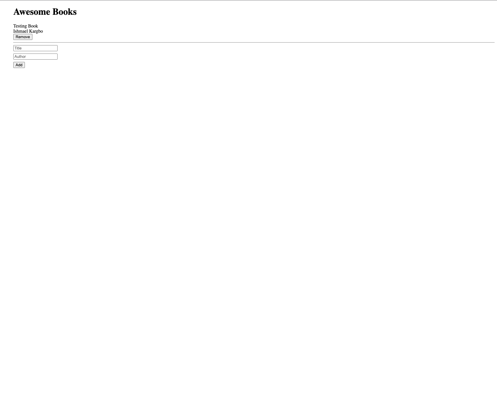

# Awsome Book

Awesome books is a simple website that displays a list of books and allows you to add and remove books from that list.

#### Desktop Screenshot

## Built With

- HTML and CSS

- ESLint

- JavaScript

## Live Demo

<a href="https://ishmaelkargbo.github.io/awesome-books/">Awesome Books</a>

## Getting Started

To get a local copy up and running follow these simple example steps.

- Clone this repository to your local machine
- git clone https://github.com/IshmaelKargbo/code4easy.git
- cd Portfolio
- Open `index.html` file in a browser of your choice

## Authors

👤 **Ishmael Kargbo**

- GitHub: [@githubhandle](https://github.com/ishmaelkargbo)
- Twitter: [@twitterhandle](https://twitter.com/ishoKargbo)
- LinkedIn: [LinkedIn](https://linkedin.com/in/ishmael-kargbo-9a986a214)

## 🤝 Contributing

Contributions, issues, and feature requests are welcome!

Feel free to check the [issues page](../../issues/).

## Show your support

Give a ⭐️ if you like this project!
